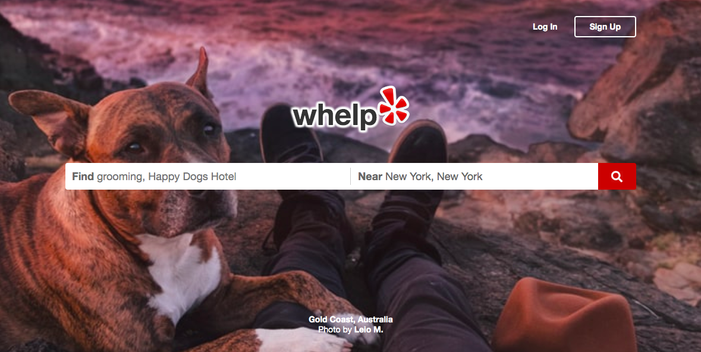
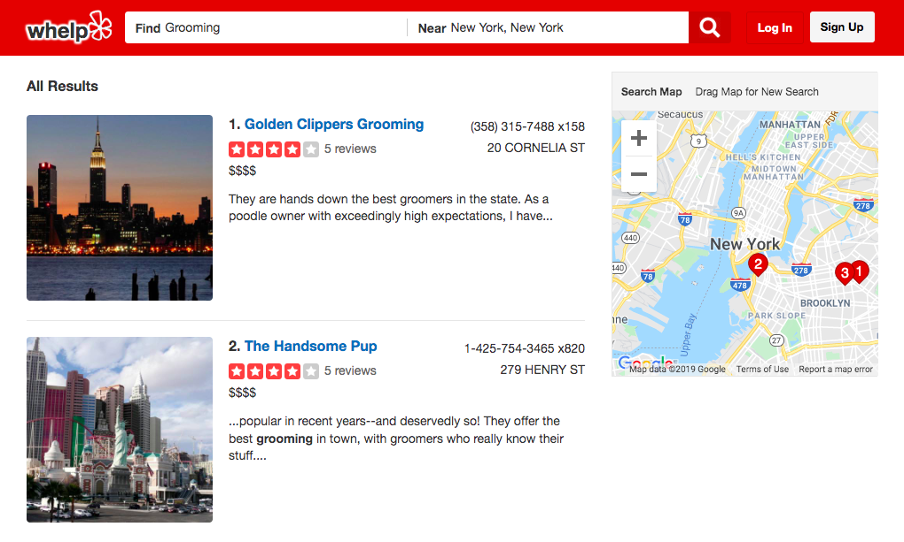
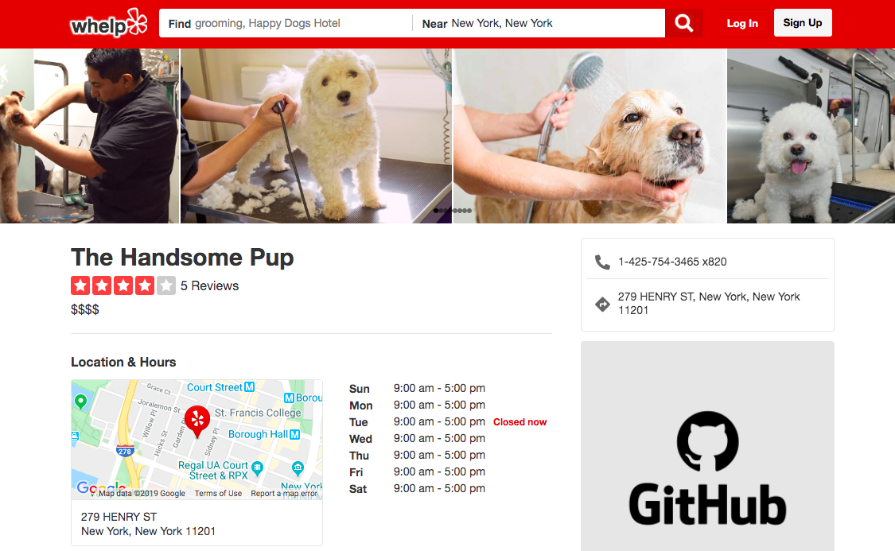
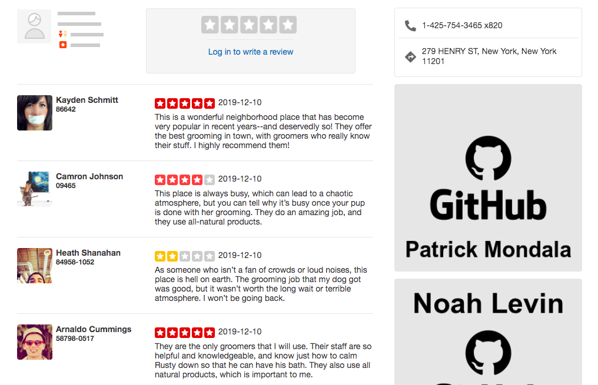
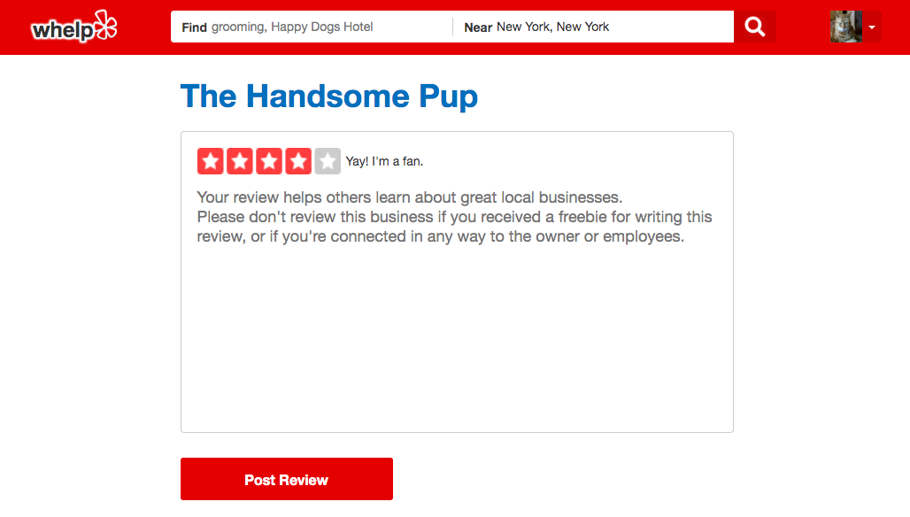

# Whelp

[Live site](http://whelp-app.herokuapp.com/)

# Description

Whelp is a site for dog-owners to come together to share the good, the bad, and the ugly of businesses that offer services for dogs. Visitors can search businesses, browse reviews, and add their own reviews.

# Technologies

  * MERN stack
    * MongoDB
    * Express.js
    * React
    * Node.js
  * Google Maps API


# Features

## Splash

Visitors can search right from the splash page or navigate to the log in and sign up pages.



## Business Search

Visitors can search for relevant businesses in a specified location. Search results show up conveniently both in a list and on the map.



## Business Reviews

After searching for businesses, users can click through to view more information about a business and to browse its reviews.




## Writing a Review

Logged in users can rate businesses and write reviews.



# Implementation and Technical Challenges

At the heart of Whelp's functionality is the ability to search for relevant businesses in a specific location and to see them displayed on the map.

## Submitting a Search

When users search for businesses, they enter two pieces of information: the query itself and their location. Upon submission of the search, the SearchBar component uses React Router to enter this information into the URL's query string:
```
  handleSearch(e) {
    e.preventDefault();
    const { businessQuery, locationQuery } = this.state;
    this.props.history.push(`/businesses/search?q=${businessQuery}&loc=${locationQuery}`);
  }
```

### Geolocation

Next, the Google Maps API geocodes the inputted location string into latitude and longitude:

```
  const geocoder = new google.maps.Geocoder();
  geocoder.geocode({ address: searchParams.get("loc") }, (res, status) => {
    ...
    const pos = res[0].geometry.location;
    const lat = pos.lat();
    const lng = pos.lng();
    ...
  }
```

The latitude and longitude go into construction of the map, which then transmits its boundaries to the search function:

```
  const bounds = this.map.getBounds();
  const southWest = bounds.getSouthWest();
  const northEast = bounds.getNorthEast();
  this.props.triggerSearch({
    southWest: { lat: southWest.lat(), lng: southWest.lng() },
    northEast: { lat: northEast.lat(), lng: northEast.lng() }
  });
```

### Executing the Search

The search query and map boundaries pass to the API endpoint on the backend. There, through the use of MongoDB's aggregation pipeline, a full-text search is performed on business reviews. The reviews are aggregated by business and the results sorted according to the average relevance score of the text search:

```
  Review
    .aggregate([ 
      { $match: { $text: { $search: query } } },
      { $group: { _id: "$businessId", avgScore: { $avg: { $meta: "textScore" } } } },
      { $sort: { avgScore: -1 } }
    ])
```

Finally, the search results are narrowed down to those businesses that fit within the boundaries of the map:

```
  Business
    .find({ 
      _id: { $in: searchResults },
      lat: { $gt: bounds.southWest.lat, $lt: bounds.northEast.lat },
      lng: { $gt: bounds.southWest.lng, $lt: bounds.northEast.lng } 
    })
```

If the user adjusts the position of the map, the search results will update accordingly.

# Future Features
  * business tags
  * filters/sorting for searching businesses
  * loading modals during search